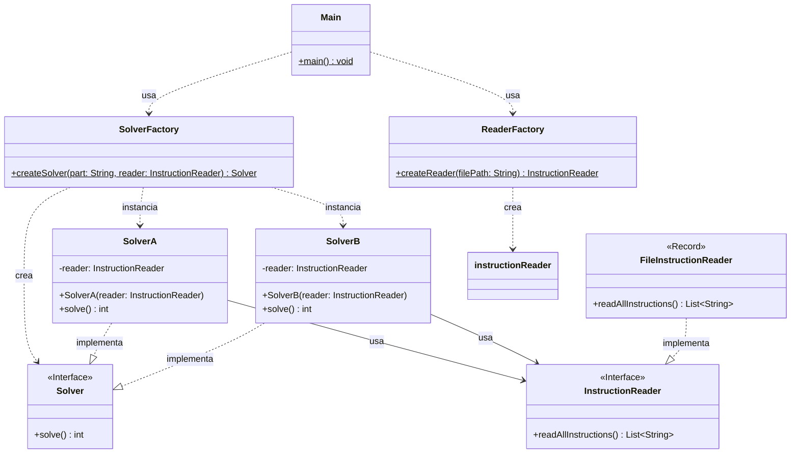

# Advent of Code 2025 - Day 1: Secret Entrance

Este proyecto contiene la solución para el **Día 1** del Advent of Code 2025. El objetivo es descifrar la contraseña de una caja fuerte simulando su mecanismo de dial giratorio.

## Diseño y Arquitectura

En este proyecto se aplican estrictamente los principios SOLID y Clean Code, junto con patrones de diseño estratégicos para garantizar un código mantenible, extensible y testeable.

### 1. Principios SOLID

- **Single Responsibility Principle (SRP)**:
  - `ReaderFactory` y `SolverFactory`: Responsables únicamente de la creación de objetos.
  - `FileInstructionReader`: Responsable de la lectura de archivos.
  - `Dial`: Encapsula toda la lógica del dominio del problema.
  - `SolverA` / `SolverB`: Coordinan la lógica específica para cada parte del problema.
- **Open/Closed Principle (OCP)**:
  - El sistema es extensible mediante interfaces. Se pueden agregar nuevos tipos de `InstructionReader` o nuevas implementaciones de `Solver` (por ejemplo, para una Parte C) sin modificar el código existente en `Main` o en las fábricas base (simplemente extendiendo la lógica).
- **Liskov Substitution Principle (LSP)**:
  - `SolverA` y `SolverB` son intercambiables a través de la interfaz `Solver`.
  - `FileInstructionReader` puede ser sustituido por cualquier otra implementación de `InstructionReader` (ej. `NetworkInstructionReader`) sin romper el sistema.
- **Interface Segregation Principle (ISP)**:
  - Las interfaces `Solver` e `InstructionReader` son específicas y no obligan a las clases a implementar métodos que no usan.
- **Dependency Inversion Principle (DIP)**:
  - Los módulos de alto nivel (`Main`, `SolverA`...) dependen de abstracciones (`Solver`, `InstructionReader`), no de implementaciones concretas.

### 2. Patrones de Diseño

Se han implementado patrones de diseño clásicos para resolver problemas de creación y comportamiento:

- **Strategy Pattern (Estrategia)**:

  - La interfaz `Solver` define una estrategia común (`solve`).
  - `SolverA` y `SolverB` son estrategias concretas que encapsulan la lógica de resolución para la Parte A y la Parte B respectivamente.
  - El cliente (`Main`) utiliza la interfaz `Solver` sin acoplarse a la lógica específica.

- **Factory Pattern (Fábrica)**:

  - `SolverFactory`: Centraliza la creación de los Solvers. Basado en un parámetro ("A" o "B"), decide qué estrategia instanciar. Esto desacopla al `Main` de conocer las clases concretas.
  - `ReaderFactory`: Abstrae la creación del lector de instrucciones, facilitando cambios futuros en la fuente de datos.

- **Dependency Injection**:
  - Las dependencias (como `InstructionReader`) se inyectan en los constructores de los Solvers, en lugar de ser creadas internamente.

### 3. Diagrama de Arquitectura

### 4. Estructura del Proyecto

La estructura de paquetes refleja la separación de responsabilidades:

- `software.aoc.day01`: Interfaces y Fábricas comunes (`Solver`, `InstructionReader`, `Factories`).
- `software.aoc.day01.a`: Implementación concreta para la Parte A (`SolverA`, `Dial` específico).
- `software.aoc.day01.b`: Implementación concreta para la Parte B (`SolverB`, `Dial` específico).
