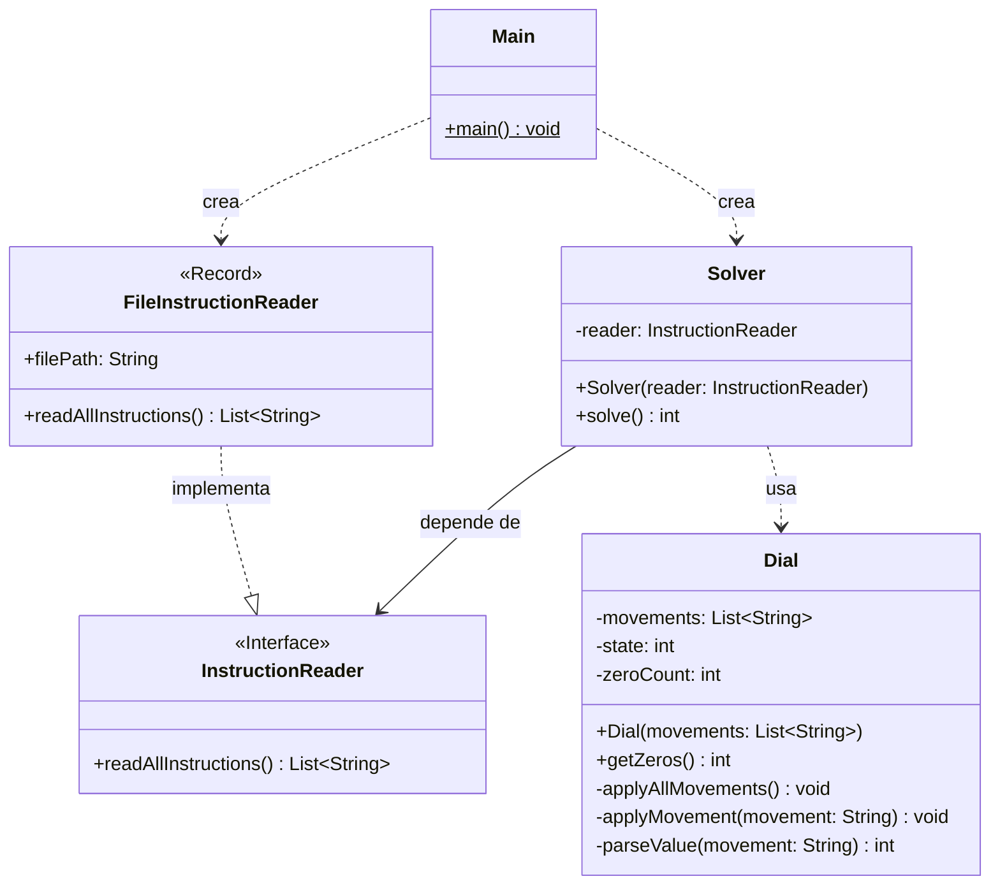

# Advent of Code 2025 - Day 1: Secret Entrance

Este proyecto contiene la solución para el **Día 1** del Advent of Code 2025. El objetivo es descifrar la contraseña de una caja fuerte simulando su mecanismo de dial giratorio.

## Diseño y Arquitectura

En este proyecto se intenta aplicar los principios SOLID y Clean Code para resolver el problema. Además se intenta aplicar patrones de diseño para resolver los diferentes problemas del AOC2025.

### 1. Principios SOLID

El diseño se adhiere principalmente a los siguientes principios:

- **Single Responsibility Principle (SRP)**: Cada clase tiene una responsabilidad única y claramente definida.
  - `FileInstructionReader`: Se encarga **únicamente** de la persistencia/lectura de datos. Desconoce la lógica de negocio.
  - `Dial`: Encapsula la **lógica de dominio** (el comportamiento de la caja fuerte). Desconoce el origen de los datos.
  - `Solver`: **Coordinador** del caso de uso. Orquesta la interacción entre la lectura de datos y el dominio para producir una solución.
  - `Main`: Punto de entrada minimalista. Solo es responsable de iniciar la aplicación invocando al `Solver`.
- **Dependency Inversion Principle (DIP)**: `Solver` no depende de la clase concreta `FileInstructionReader`, sino de la abstracción `InstructionReader`. Esto permite cambiar el origen de los datos (archivo, base de datos, API) sin tocar la lógica de resolución.
- **Open/Closed Principle**: Gracias a la interfaz `InstructionReader`, el sistema está abierto a la extensión (nuevas formas de leer datos) pero cerrado a la modificación (`Solver` no cambia).

### 2. Clean Code (Código Limpio)

Se han seguido prácticas de Clean Code para asegurar que el código sea autoexplicativo:

- **Nombres Expresivos**: Variables y métodos como `applyMovement`, `zeroCount` o `movements` revelan claramente su intención sin necesidad de comentarios.
- **Funciones Pequeñas**: Métodos como `parseValue` extraen lógica compleja de bajo nivel, manteniendo el flujo principal de `applyMovement` legible y de alto nivel.
- **Evitar "Magic Numbers"**: El uso de constantes numéricas se explica por el contexto del dominio (ej. módulo 100 para un dial de 0-99).

### 3. Gestión del Flujo de Datos

El flujo de información es lineal y unidireccional, simplificando la trazabilidad:

1.  **Input (I/O)**: `InstructionReader` (implementado por `FileInstructionReader`) provee la lista de instrucciones.
2.  **Procesamiento (Domain)**: `Dial` recibe la lista inmutable de instrucciones y calcula el resultado.
3.  **Output**: `Solver` orquesta el proceso y devuelve la solución final.

### 4. Estructuras de Datos y Algoritmos

- **`List<String>`**: Se eligió `ArrayList` para almacenar las instrucciones debido a que el orden de ejecución es crítico y el acceso secuencial es performante.
- **Aritmética Modular**: La fórmula `(state + valor + 100) % 100` maneja el dial circular.
- **Record**: `FileInstructionReader` es un `record` inmutable.

### 5. Diagrama de Clases

## Estructura del Proyecto

Organización por paquetes para separar las dos partes del desafío:

- `src/main/java/software/aoc/day01/a`: Solución Parte 1 (Conteo final).
- `src/main/java/software/aoc/day01/b`: Solución Parte 2 (Conteo paso a paso).
